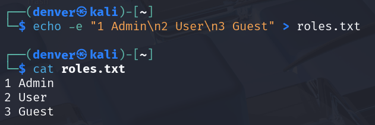

---

layout: default
title: "Homework 1: Linux Command Line Basics"
----------------------------------------------

<center>
  

# **Homework 1: Linux Command Line Basics**

**Môn học: Hệ điều hành Linux và ứng dụng** 

**CS11117 - 22MMT**

**Sinh viên: Nguyễn Hồ Đăng Duy - 22127085**

</center>

## Table of Contents

- [Task 1: System Investigation](#task-1-system-investigation)
- [Task 2: Directory Setup](#task-2-directory-setup)
- [Task 3: Log Review](#task-3-log-review)
- [Task 4: Pattern Search](#task-4-pattern-search)
- [Task 5: Stream Redirection](#task-5-stream-redirection)
- [Task 6: Text Processing](#task-6-text-processing)
- [Task 7: Cleanup Script](#task-7-cleanup-script)
- [Task 8: File Hunting](#task-8-file-hunting)
- [Task 9: Joining Data](#task-9-joining-data)
- [Task 10: Line Numbering \& Word Counts](#task-10-line-numbering--word-counts)

---

## Task 1: System Investigation

> **1. Find out what directory you are currently in.**

```bash
pwd
```

**Explanation:**

* `pwd` (print working directory) prints the full path of the current directory. It helps users know their current location in the file system.
**Screenshot:**


> **2. Go to the Documents directory inside your home directory using a relative path.**

```bash
cd ~/Documents
```

**Explanation:**

* `cd ~/Documents` changes to the `Documents` directory located in the current user's home directory (~ stands for `/home/denver`).

**Screenshot:**


---

> **3. Confirm your new location.**

```bash
pwd
```

**Explanation:**

* `pwd` is used again to confirm that the new current directory is `/home/denver/Documents`.

**Screenshot:**


---

## Task 2: Directory Setup

> **1. Create a folder named `project_logs` in your current directory.**

```bash
mkdir project_logs
```

**Explanation:**

* `mkdir project_logs` creates a folder named `project_logs` in the current directory..

**Screenshot:**


---

> **2. Inside it, create subfolders `old_backup`, `archive`, and `current`.**

```bash
cd project_logs
mkdir old_backup archive current
```

**Explanation:**

* `cd project_logs` navigates into the newly created folder.
* `mkdir old_backup archive current` creates three subfolders at once.

**Screenshot:**


---

> **3. Then, create a file `temp.txt`.**

```bash
touch temp.txt
```

**Explanation:**

* `touch temp.txt` creates an empty file named `temp.txt`.

**Screenshot:**


---

> **4. Verify that they exist.**

```bash
ls -l
```

**Explanation:**

* `ls -l` lists the files and directories in detail to confirm they were created successfully.

**Screenshot:**


---

## Task 3: Log Review

> **1. You received a system log file at `/var/log/syslog`.**
```bash
sudo touch /var/log/syslog
sudo tee /var/log/syslog > /dev/null <<EOF
```
**Explanation:**
* `Kali Linux` doesn't have log file at `/var/log/syslog` so I created a temporary file to do this task
  
**Screenshot:**


---

> **2. Display the first 5 lines of the file.**

```bash
head -n 5 /var/log/syslog
```

**Explanation:**

* `head -n 5` shows the first 5 lines of the file to give an overview of its beginning.

**Screenshot:**


---

> **3. Display the last 10 lines of the file.**

```bash
tail -n 10 /var/log/syslog
```

**Explanation:**

* `tail -n 10` displays the last 10 lines, usually showing the most recent logs.

**Screenshot:**


---

> **4. Reverse the content of the file for a quick scan.**

```bash
tac /var/log/syslog
```

**Explanation:**

* `tac` (reverse `cat`) displays the file from bottom to top, which can be helpful when viewing recent logs without scrolling.

**Screenshot:**


---

## Task 4: Pattern Search

> **1. Search for all lines that contain the word `error` (case-insensitive).**

```bash
grep -i "error" /var/log/syslog
```

**Explanation:**

* `grep -i` searches for the word `error` without case sensitivity and redirects the output to `errors.log`.

**Screenshot:**


---

> **2. Count how many such lines exist.**

```bash
grep -i "error" /var/log/syslog > errors.log
wc -l errors.log
```

**Explanation:**
* Redirect the output of `grep -i "error" /var/log/syslog` to `errors.log`.
* `wc -l` counts the number of lines in `errors.log`, which is the number of matching lines.

**Screenshot:**


---

## Task 5: Stream Redirection

> **1. Redirect the list of all files in `/etc` into a file named `etc_list.txt` without showing it on screen.**

```bash
ls /etc > etc_list.txt
```

**Explanation:**

* The `ls /etc` list all files in `/etc`.
* The  `>` operator saves the output to `etc_list.txt` and does not display it in the terminal.

**Screenshot:**


---

> **2. Append the list of files from `/bin` to the same file.**

```bash
ls /bin >> etc_list.txt
```

**Explanation:**

* `>>` appends the output to `etc_list.txt` without overwriting the previous content.

**Screenshot:**


---

> **3. View the result one page at a time.**

```bash
less etc_list.txt
```

**Explanation:**

* `less` allows viewing a file one screen at a time with scroll support.

**Screenshot:** The content of `etc_list.txt` is longer than 3 images below.

<p float="left">
  
  
  
</p>

---

## Task 6: Text Processing

> **1. Create a file `users.txt` with the content:** <br>
> Alice:Admin <br>
> Bob:User<br>
> Carol:Guest

```bash
echo -e "Alice:Admin\nBob:User\nCarol:Guest" > users.txt
```

**Explanation:**

* `echo -e` prints multiple lines into `users.txt`, using `\n` to break lines.

**Screenshot:**


---

> **2. Use `cut` or `awk` to extract usernames.**

```bash
cut -d ":" -f 1 users.txt
```

**Explanation:**

* `cut -d ":" -f 1` extracts the part before `:` on each line:
  * `-d` stands for **delimiter**. In this case, the delimiter is a colon `:`, so each line will be split at every `:`.
  * `-f` stands for **field**. `-f 1` means take the first field - the part before the first `:` in each line
  * `users.txt` is the file that contains the data to be processed.
**Screenshot:**


---

> **3. Use `tr` to convert them to lowercase.**

```bash
cut -d ":" -f 1 users.txt | tr 'A-Z' 'a-z'
```

**Explanation:**
*  `|` is called the pipe operator. It is used to connect the output of one command to the input of another command.
* `tr 'A-Z' 'a-z'` converts all uppercase letters to lowercase.

**Screenshot:**


---

> **4. Use `sort` to display in reverse alphabetical order.**

```bash
cut -d ":" -f 1 users.txt | tr 'A-Z' 'a-z' | sort -r
```

**Explanation:**

* `sort -r` sorts the list in reverse alphabetical order (Z to A).

**Screenshot:**


---

## Task 7: Cleanup Script

> **1. Remove an empty directory named `old_backup`.**

```bash
rmdir old_backup
```

**Explanation:**

* `rmdir` removes empty directories. It will fail if the directory is not empty.

**Screenshot:**


---

> **2. Delete a file named `temp.txt`.**

```bash
rm temp.txt
```

**Explanation:**

* `rm` deletes a file in the Linux system.

**Screenshot:**


---

> **3. Move a file `report.txt` to the `archive` folder.**

```bash
mv report.txt archive/
```

**Explanation:**

* `mv` moves  `report.txt`  into the `archive/` folder.

**Screenshot:**


---

> **4. Copy `archive/report.txt` to `current/report_backup.txt`**

```bash
cp archive/report.txt current/report_backup.txt
```

**Explanation:**

* `cp` copies the file from `archive` to `current` with a new name `report_backup.txt`.

**Screenshot:**


---

## Task 8: File Hunting

> **1. Find all `.conf` files under `/etc`.**

```bash
find /etc -type f -name "*.conf"
```

**Explanation:**

* `find` with `-type f` and `-name` finds all files ending in `.conf` under `/etc`:
  * `find` used to search files and directories in a directory hierarchy based on various criteria (name, type, permissions, size, etc.).
  * `/etc` is the starting point of the search.
  * `-type f` limits the search to **files** only.
  * `-name "*.conf` filter the search by **filename pattern**.

**Screenshot:**


---

> **2. Find all files with 755 permission in your home directory.**

```bash
find ~ -type f -perm 755
```

**Explanation:**

* Searches for files (`-type f`) in the home directory (`~`) with permission `755`:
  * `~` home directory
  * `-perm 755` tells the `find` to match files with specific permission mode:
  * `755` means:
    * Owner: read, write, execute (`7 = rwx`)
    * Group: read, execute (`5 = r-x`)
    * Others: read, execute (`5 = r-x`)

**Screenshot:**


---

> **3. Find all directories under `/usr` that contain the word `lib`**

```bash
find /usr -type d -name "*lib*"
```

**Explanation:**

* Finds all directories (`-type d`) with names containing `lib` under `/usr`:
  * `-type d` find directories only
  * `*lib*` is a **glob pattern** (wildcard-based string pattern). It means:
    * `*` matches zero of more characters.
    * `lib` is the literal string being searched for
    * `*lib*` matches any name that contains the word `lib` anywhere.

**Screenshot:**

<p float="left">
  
  
</p>

---

## Task 9: Joining Data

> **1. Create file `names.txt`**

```bash
echo -e "1 Alice\n2 Bob\n3 Carol" > names.txt
```

**Explanation:**

* Uses `echo` to simulate a list of IDs and names.

**Screenshot:**


---

> **2. Create file `roles.txt`**

```bash
echo -e "1 Admin\n2 User\n3 Guest" > roles.txt
```

**Explanation:**

* Similar to `names.txt`, but for corresponding roles.

**Screenshot:**



---

> **3. Join them into one file with both name and role.**

```bash
join names.txt roles.txt > names_roles.txt
```

**Explanation:**

* `join names.txt roles.txt`: merges the two files based on the first field (ID).
* `>` redirects the result into a new file named `names_roles.txt`.

**Screenshot:**


## Task 10: Line Numbering & Word Counts

> **1. Use `nl` to number the lines of `users.txt`**

```bash
nl users.txt
```

**Explanation:**

* `nl` stands for number lines. It displays the contents of the file while automatically adding line numbers at the beginning of each line.

**Screenshot:**


---

> **2. Use `wc` to count number of lines, words, and bytes**

```bash
wc users.txt
```

**Explanation:**

* `wc` stands for word count. It provides three statistics for the specified file:
  * Number of lines.
  * Number of words.
  * Number of bytes (or characters).

**Screenshot:**


