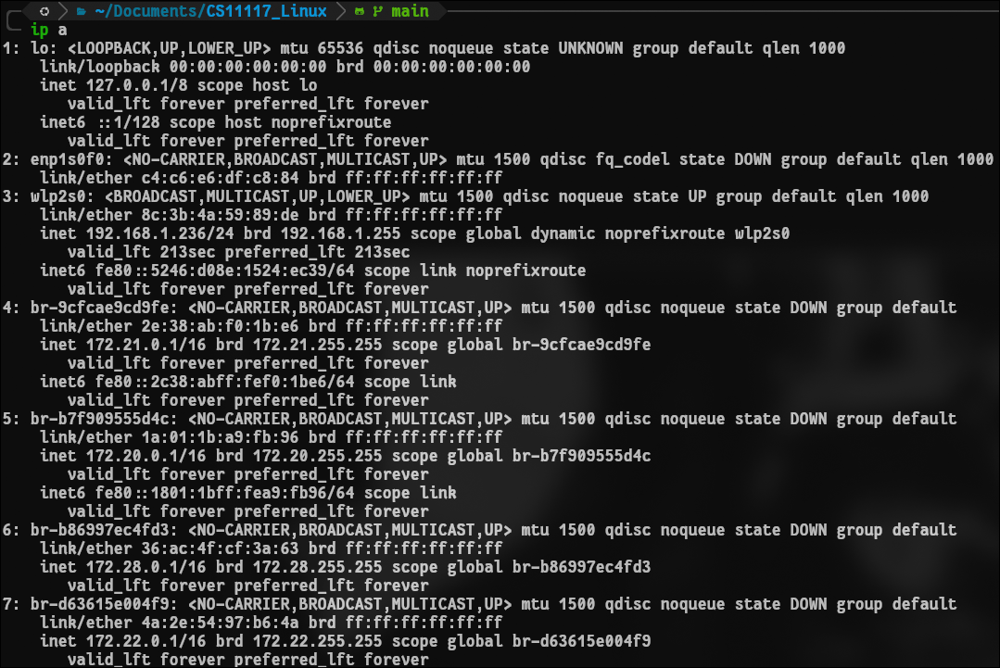
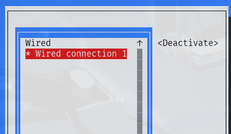
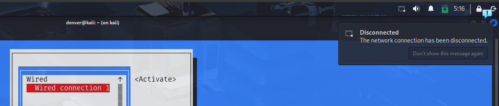

---

layout: default
title: "Homework 4: Basic Network Management"
---

<center>
  

# **Homework 4: Basic Network Management**

**Môn học: Hệ điều hành Linux và Ứng dụng**  
**CS11117 - 22MMT**  
**Sinh viên: Nguyễn Hồ Đăng Duy - 22127085**

</center>

## Table of Contents

* [Step 1: Network Interfaces & IP Addresses](#step-1-network-interfaces--ip-addresses)
* [Step 2: DNS Configuration](#step-2-dns-configuration)
* [Step 3: Hostname Setup](#step-3-hostname-setup)
* [Step 4: Check Open Ports and Services](#step-4-check-open-ports-and-services)
* [Step 5: Test Connectivity](#step-5-test-connectivity)
* [Step 6: Test Web Requests](#step-6-test-web-requests)
* [Step 7: Use nmcli to View Connections](#step-7-use-nmcli-to-view-connections)
* [Step 8: Modify a Connection via nmcli](#step-8-modify-a-connection-via-nmcli)
* [Step 9: Use nmtui for Configuration](#step-9-use-nmtui-for-configuration)
* [Step 10: Enable/Disable Network Connection](#step-10-enabledisable-network-connection)


---

## Step 1: Network Interfaces & IP Addresses

### 1. Display all network interfaces and their IP addresses

```bash
ip a
```

**Explanation:**

* `ip a` (short for `ip address`) shows all network interfaces along with their current IP address configurations.

**Screenshot:**



---

### 2. Identify the system's main IP address and interface name

```bash
ip route | grep default
```

**Explanation:**

* This command shows the default route, including the primary network interface and gateway used for internet access.

**Screenshot:**


---

## Step 2: DNS Configuration

### 1. View DNS configuration file

```bash
cat /etc/resolv.conf
```

**Explanation:**

* Shows current DNS server settings. It's dynamically updated by your network manager.

**Screenshot:**


---

### 2. Temporarily set DNS to Google's 8.8.8.8

```bash
sudo nano /etc/resolv.conf
```

**Then add line:**

```
nameserver 8.8.8.8
```

**Explanation:**

* Manually sets a DNS server (temporary until reboot or DHCP renewal).

**Screenshot:**


---

### 3. Test DNS resolution

```bash
dig google.com
# or
nslookup google.com
```

**Explanation:**

* Checks if DNS resolution is working by translating a domain name to an IP address.

**Screenshot:**


---

## Step 3: Hostname Setup

### 1. Set hostname to `mystudent-pc`

```bash
sudo hostnamectl set-hostname mystudent-pc
```

**Explanation:**

* This sets a permanent system hostname using `systemd`.

**Screenshot:**


---

### 2. Confirm new hostname

```bash
hostname
```

**Explanation:**

* Displays the current hostname to verify the change was applied.

**Screenshot:**


---

## Step 4: Check Open Ports and Services

### 1. Show listening ports

```bash
ss -tuln
```

**Explanation:**

* Lists all TCP/UDP listening ports without resolving service names.

**Screenshot:**


---

### 2. Identify which service is using port 22

```bash
sudo lsof -i :22
```

**Explanation:**

* Finds the process using port 22

**Screenshot:**


---

## Step 5: Test Connectivity

### 1. Ping to check if reachable

```bash
ping -c 4 google.com
```

**Explanation:**

* Sends 4 ICMP packets to test if Google is reachable.

**Screenshot:**


---

### 2. Trace route to Google

```bash
traceroute google.com
```

**Explanation:**

* Displays the path (hops) that packets take to reach Google.

**Screenshot:**


---

## Step 6: Test Web Requests

### 1. Download homepage using curl or wget

```bash
curl http://example.com
# or
wget http://example.com
```

**Screenshot:**


---

Certainly! Here's the explanation for **part b** in English:

---

### 2. Explain the difference between `curl` and `wget`

| Feature                 | `curl`                                             | `wget`                                                 |
| ----------------------- | -------------------------------------------------- | ------------------------------------------------------ |
| **Main Purpose**        | Transfers data to or from a server using protocols | Downloads files from the web (HTTP, HTTPS, FTP, etc.)  |
| **Default Behavior**    | Prints output to the terminal (`stdout`)           | Automatically saves the file to disk                   |
| **POST/Upload Support** | Strong support (POST, PUT, custom headers, etc.)   | Limited; mostly used for downloading files (GET only)  |
| **Recursive Download**  | ❌ Not supported                                    | ✅ Supported (can download entire websites recursively) |
| **Pre-installed on**    | Most Unix-based systems including macOS and Linux  | Linux (usually), not always pre-installed on macOS     |
| **Output Formatting**   | Highly customizable using flags (`-o`, `-H`, `-i`) | Less customizable, but straightforward for downloading |


---

## Step 7: Use nmcli to View Connections

### 1. Show all network connections

```bash
nmcli connection show
```

**Explanation:**

* Lists all saved network connections.

**Screenshot:**


---

### 2. Show currently active connection

```bash
nmcli connection show --active
```

**Explanation:**

* Displays which connections are currently active.

**Screenshot:**


---

## Step 8: Modify a Connection via nmcli

### 1. Set static IP address

```bash
nmcli connection modify eth0 ipv4.addresses 192.168.1.123/24
nmcli connection modify eth0 ipv4.method manual
nmcli connection up eth0
```

**Explanation:**

* Assigns a static IP temporarily to `eth0`.

**Screenshot:**


---

### 2. Revert back to DHCP

```bash
nmcli connection modify eth0 ipv4.method auto
nmcli connection up eth0
```

**Explanation:**

* Restores automatic IP assignment (DHCP).

**Screenshot:**


---

## Step 9: Use nmtui for Configuration

### 1. Launch nmtui (graphical)

```bash
nmtui
```

**Explanation:**

* Opens a terminal UI to manage connections.

**Screenshot:**


### 2. Describe the steps for:

**Activating / Deactivating a Network Connection:**

* In the main menu, select: `Activate a connection`
 


* A list of available connections will appear.
 


* Use the arrow keys to select the desired connection (e.g., Wired connection 1).
* Press Enter to:
  * Deactivate the connection if it's active.
   
  

  * Activate the connection if it's inactive.
   
  
  

---

## Step 10: Enable/Disable Network Connection

### 1. Disable connection

```bash
nmcli connection down eth0
```

**Explanation:**

* Temporarily disables the selected network connection.

**Screenshot:**


---

### 2. Re-enable connection

```bash
nmcli connection up eth0
```

**Explanation:**

* Re-enables and reconnects to the network.

**Screenshot:**


