---

layout: default
title: "Homework 5: SSH Configuration"
---

<center>
  

# **Homework 5: SSH Configuration**

**Môn học: Hệ điều hành Linux và Ứng dụng**  
**CS11117 - 22MMT**  
**Sinh viên: Nguyễn Hồ Đăng Duy - 22127085**

</center>

## Table of Contents

* [1: Disable Root SSH Access](#1-disable-root-ssh-access)
* [2: Create SFTP-Only User (No Shell)](#2-create-sftp-only-user-no-shell)
* [3: Configure SSH Key-Based Authentication](#3-configure-ssh-key-based-authentication)

---

## 1: Disable Root SSH Access

### 1.1 Edit SSH configuration file

```bash
sudo nano /etc/ssh/sshd_config
```

Change or add the line:

```bash
PermitRootLogin no
```

**Explanation:**
* This command opens the SSH daemon configuration file. Setting `PermitRootLogin no` disables direct SSH login using the root account, reducing the attack surface and improving security.

**Screenshot:**

*Edited `sshd_config` with `PermitRootLogin no` set.*

 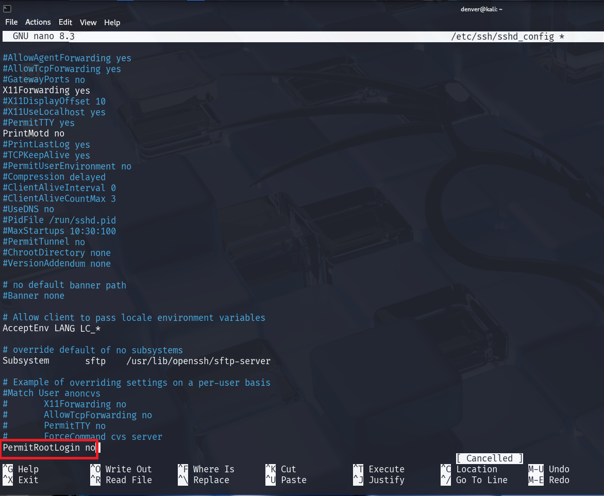

  

### 1.2 Restart SSH service

```bash
sudo systemctl restart sshd
```

**Explanation:**
* Applies the changes made to the SSH config. Without restarting, modifications won’t take effect.

**Screenshot:**

  *Restart ssh service.*

 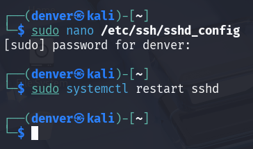


### 1.3 Result:

After applying the change, attempts to login via `ssh root@192.168.1.100` should be rejected with a message such as `Permission denied`. This confirms root SSH access is successfully disabled.

*Output of `systemctl status sshd` showing SSH service is running.*

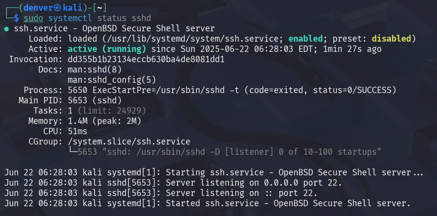

*Login via `ssh root@192.168.1.100` was rejected and we can see log from SSH service*
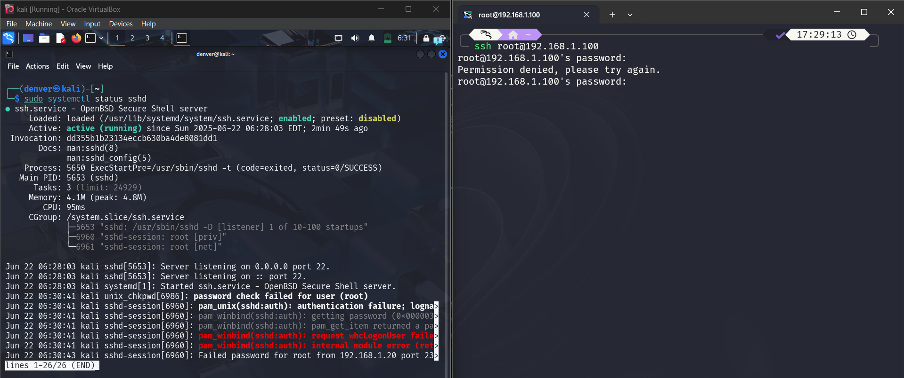

---

## 2: Create SFTP-Only User (No Shell)

### 2.1 Create user and set password

```bash
sudo adduser sftpuser
```

**Explanation:**

* `adduser` creates a new account. This account will be used for SFTP only, no shell access.

**Screenshot:**

 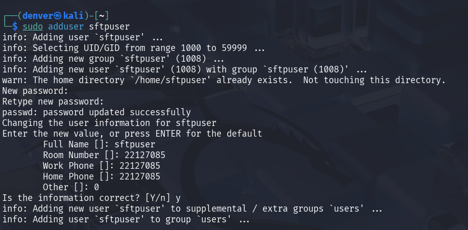

### 2.2 Setup chroot directory

```bash
sudo mkdir -p /home/sftpuser/uploads
sudo chown root:root /home/sftpuser
sudo chmod 755 /home/sftpuser
sudo chown sftpuser:sftpuser /home/sftpuser/uploads
```

**Explanation:**

`mkdir -p` ensures upload folder exists. `chown root:root` and `chmod 755` are required for SSH chroot jails. User must only have ownership inside the uploads folder.

**Screenshot:**

 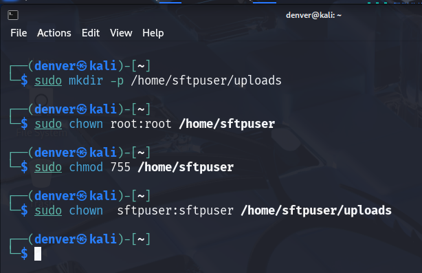

### 2.3 Update SSH configuration

```bash
sudo nano /etc/ssh/sshd_config
```

Add to bottom:

```bash
Match User sftpuser
    ForceCommand internal-sftp
    ChrootDirectory /home/sftpuser
    PermitTunnel no
    AllowAgentForwarding no
    AllowTcpForwarding no
    X11Forwarding no
```

**Explanation:**

This restricts `sftpuser` to SFTP only. `ChrootDirectory` confines the user, preventing access to other system areas:
* `Match User sftpuser`: a conditional block: only the following lines will apply to `sftpuser`.
* `ForceCommand internal-sftp`: Prevents user from executing arbitrary commands — limits to file transfer only.
* `ChrootDirectory /home/sftpuser`: Enhances security by sandboxing the user into a limited environment.
* `PermitTunnel no`: Disables port tunneling features for `sftpuser`.
* `AllowAgentForwarding no`: Security hardening — avoids abuse of forwarded authentication.
* `AllowTcpForwarding no`: Blocks `sftpuser` from using SSH to access or route other network traffic.
* `X11Forwarding no`: Disables X11 forwarding (GUI over SSH).

**Screenshot:**

 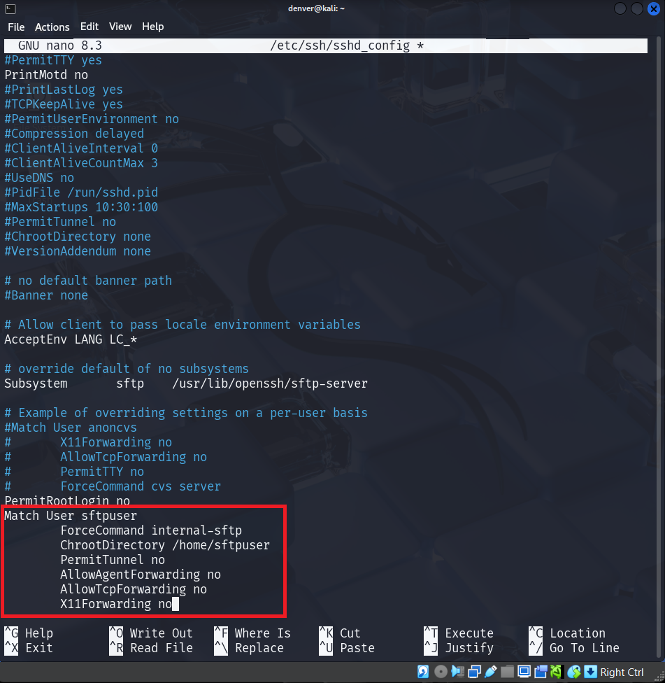

### 2.4 Restart SSH

```bash
sudo systemctl restart sshd
```

### 2.5 Result:

 When logging in using `sftp sftpuser@192.168.1.100`, the user should be able to upload and download files. If attempting to SSH with `ssh sftpuser@192.168.1.100`, the session will immediately close or be denied, proving shell access is blocked.

**Screenshot:**

 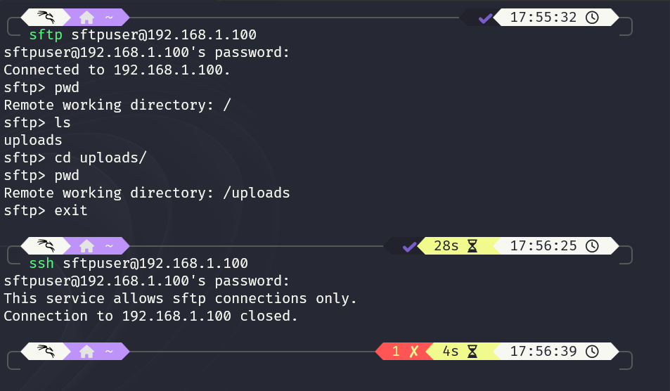
---

## 3: Configure SSH Key-Based Authentication

### 3.1 Create new user

```bash
sudo adduser studentuser
```


**Screenshot:**

 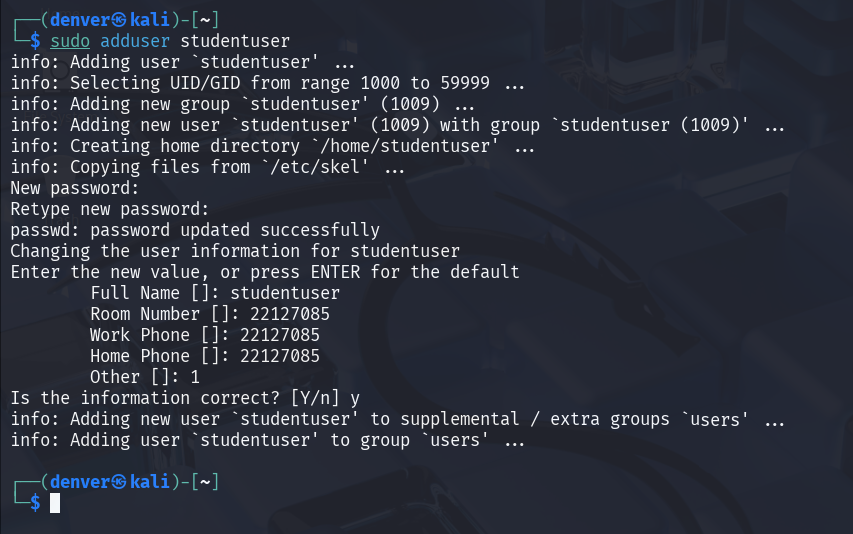

### 3.2 On client: generate SSH key (if not already)

```bash
ssh-keygen
```

**Explanation:**

Generates a public/private RSA key pair in `~/.ssh/id_rsa` and `id_rsa.pub`. These are used for secure login without passwords.

### 3.3 Copy public key to server

```bash
ssh-copy-id studentuser@192.168.1.100
```

**Explanation:**

 Places the public key in the authorized list. Only users with matching private key can log in.

**Screenshot:**

 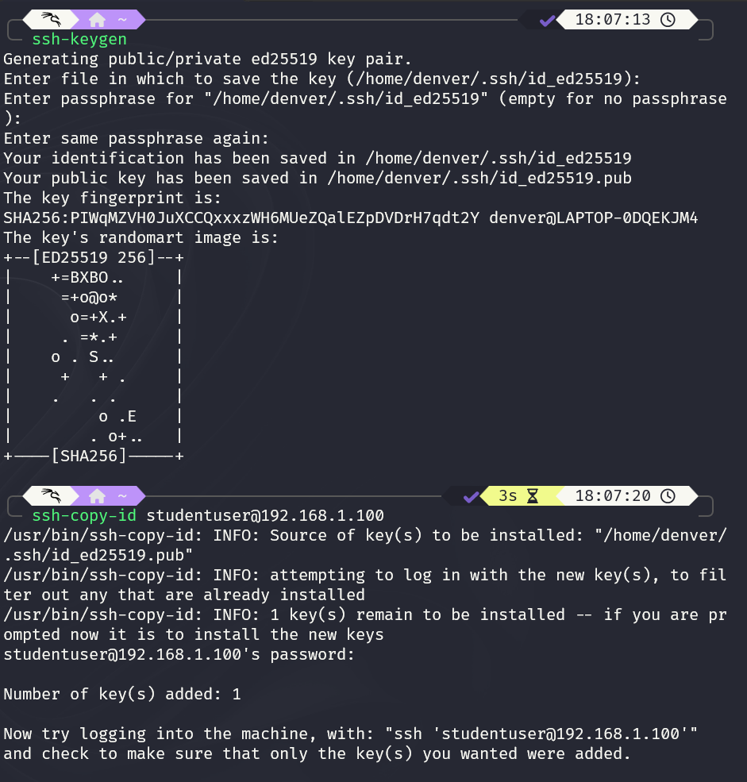

### 3.4 Disable password authentication (on server)

```bash
sudo nano /etc/ssh/sshd_config
```

Set:

```bash
PasswordAuthentication no
```

Then:

```bash
sudo systemctl restart sshd
```


**Screenshot:**

 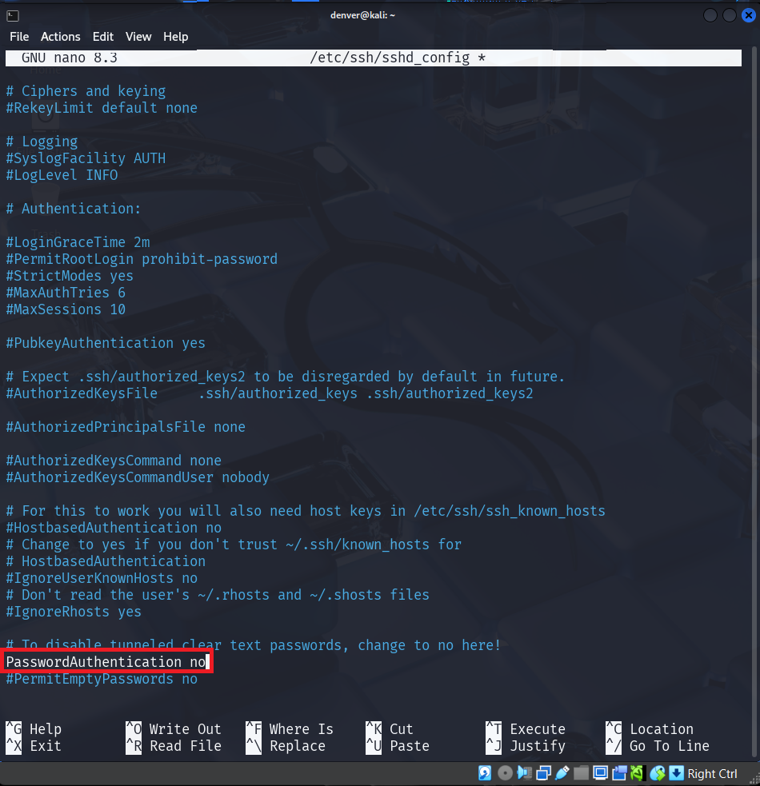

### 3.5 Result:

Logging in with `ssh studentuser@192.168.1.100` will succeed without asking for a password if the correct private key is available. If trying to login without a key or as a different user, access will be denied.

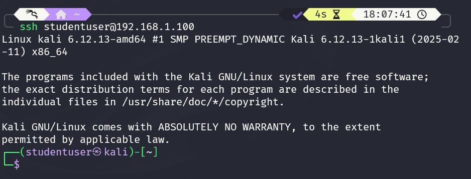
  *SSH login for `studentuser` using key-based authentication.*

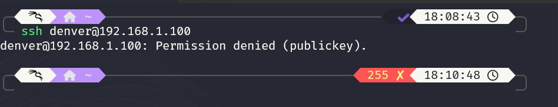
  *Login attempt using wrong user or without key failing.*

